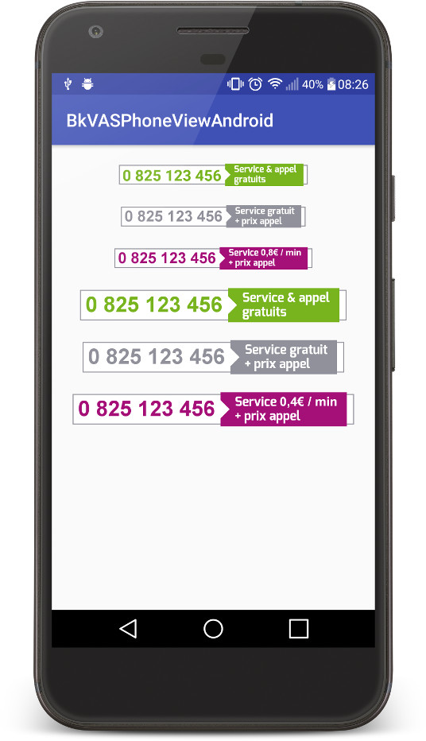

[](https://bintray.com/apps-backelite/libraries/BkVASPhoneViewAndroid)
[](http://www.apache.org/licenses/LICENSE-2.0)

BkVASPhoneViewAndroid
=======

BkVASPhoneViewAndroid is a custom view displaying phone number with the french [**Services à Valeur Ajoutée** (SVA)](assets/requirements_sva.pdf) requirements, written in Kotlin.
It supports the three main SVA billing mode that are *free*, *standard* and *chargeable*.



## Install

BkVASPhoneViewAndroid is available on jcenter. To use in your project, simply add the following dependency to your app:
```gradle
dependencies {
    ...
    implementation 'com.backelite:bkvasphoneviewandroid:1.0.1'
    ...
}
```

## Usage

You can either define the view in your layout or add it programmatically.

#### In XML

Add VASPhoneView directly in your XML layout. 5 specific attributes are available to customize the view:
* `vasPhoneViewSize` can either take values `small` or `big`, default value is `small`
* `vasPhoneViewStyle` can take values `free`, `standard` or `chargeable`, `standard` is by default
* `vasPhoneViewFee` should be set only when using `chargeable` style, and is defining the additional fee amount (e.g. 0.8 € / min)
* `vasPhoneViewPhoneNumber` where you define the phone number to display
* `vasPhoneViewDialOnClick` taking a boolean, if you want to trigger a dial intent with the corresponding phone number on click
* `vasPhoneViewArialAllowed` taking a boolean, if you want to enable **Arial-Bold** font as specified in the SVA requirements.
Beware that although Arial-Bold is the recommended font in SVA requirements for the phone number and fee amount, it is a proprietary typeface.
Therefore Roboto-Bold will be used instead by default. Set the attribute `vasPhoneViewArialAllowed` only if you have the rights to use the Arial typeface.

The following snippet shows how to integrate the view in a layout:

```xml
<com.backelite.android.bkvasphoneviewandroid.VASPhoneView
        android:id="@+id/vasphoneview_standard_big"
        android:layout_width="wrap_content"
        android:layout_height="wrap_content"
        android:layout_marginTop="@dimen/marginTop"
        app:vasPhoneViewDialOnClick="true"
        app:vasPhoneViewPhoneNumber="@string/phone_number"
        app:vasPhoneViewSize="big"
        app:vasPhoneViewStyle="standard"
        app:vasPhoneViewArialAllowed="true"/>
```

#### Programmatically

You will find the same options to add your view programmatically. Take a look at the following example (in Kotlin):

```java
val vasPhoneView = VASPhoneView(this)
                .setVASPhoneViewSize(VASPhoneViewSize.BIG)
                .setVASPhoneViewStyle(VASPhoneViewStyle.CHARGEABLE)
                .setVASPhoneViewPhoneNumber("0825123456")
                .setVASPhoneViewFeeAmount("0,4€ / min")
                .setVASPhoneViewArialAllowed(true)
                .setVASPhoneViewDialOnClick(true)
```

## Contributors

Jean-Baptiste VINCEY, jbvincey@gmail.com


License
=======

    Copyright 2017 Backelite.

    Licensed under the Apache License, Version 2.0 (the "License");
    you may not use this file except in compliance with the License.
    You may obtain a copy of the License at

       http://www.apache.org/licenses/LICENSE-2.0

    Unless required by applicable law or agreed to in writing, software
    distributed under the License is distributed on an "AS IS" BASIS,
    WITHOUT WARRANTIES OR CONDITIONS OF ANY KIND, either express or implied.
    See the License for the specific language governing permissions and
    limitations under the License.
